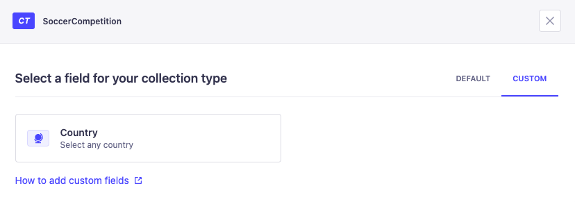
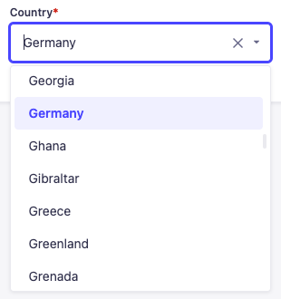

# Strapi plugin country-select

A strapi custom field for selecting any country based on the ISO 3166-1 country code standard.

## Installation

To install this plugin, you need to add an NPM dependency to your Strapi application:

```
# Using Yarn
yarn add strapi-plugin-country-select

# Or using NPM
npm install strapi-plugin-country-select
```

Then, you'll need to build your admin panel:

```
# Using Yarn
yarn build

# Or using NPM
npm run build
```


## Usage

After installation you will find the country-select at the custom fields section of the content-type builder.



Now you can select any country from the list. The Alpha-2 code of the selected country is stored in the database.




## Related

- [i18n-iso-countries](https://github.com/michaelwittig/node-i18n-iso-countries) - i18n for ISO 3166-1 country codes